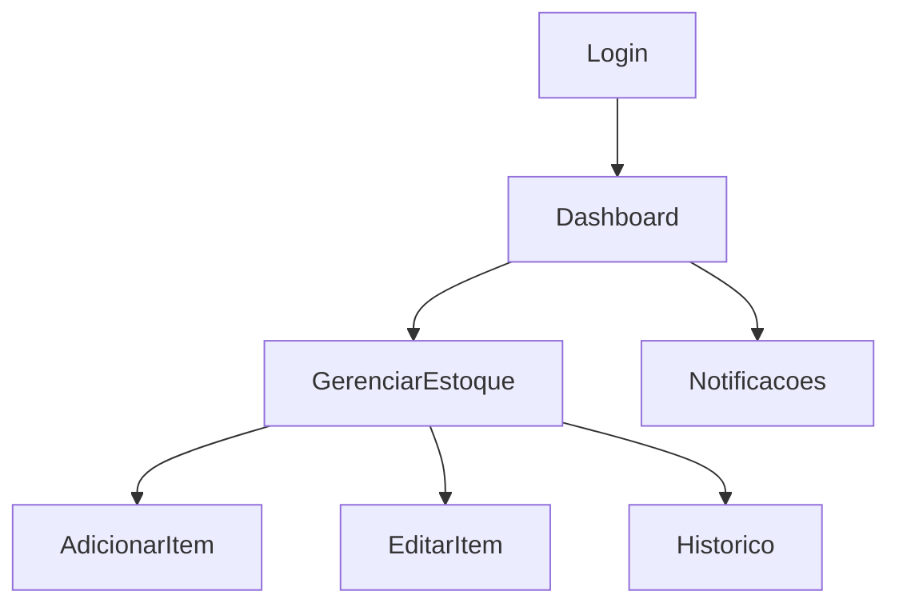

# Relatório do Projeto: Aplicação para Gestão de Estoque

## Estrutura do Projeto

A aplicação foi desenvolvida utilizando **Android Studio** e implementada com as linguagens **Kotlin** e **Java**. O projeto segue o padrão de arquitetura **MVVM (Model-View-ViewModel)**, com as seguintes camadas principais:

### Organização dos Pacotes

#### **Pacote Principal: `com.example.trabalhofinal`**

- **`models`**: Contém as classes de modelo que representam os dados da aplicação.
  - `Item.kt`: Representa um item no estoque.
  - `User.kt`: Representa os dados do usuário.

- **`repositories`**: Contém os repositórios que gerenciam o acesso a dados.
  - `ItemRepository.kt`: Gerencia os dados relacionados a itens.
  - `UserRepository.kt`: Gerencia os dados relacionados a usuários.

- **`ui`**: Contém os componentes da interface do usuário (UI), organizados em subpacotes:
  - **`encomendas`**:
    - `EncomendasItemsView.kt`: Tela para visualizar encomendas.
    - `EncomendasItemsViewModel.kt`: ViewModel para gerenciar a lógica relacionada a encomendas.
  
  - **`ExpiredItems`**:
    - `ExpiredItemsView.kt`: Tela para visualizar itens expirados.
    - `ExpiredItemsViewModel.kt`: ViewModel correspondente à lógica de itens expirados.
    - `ExpiredItemsViewPreview.kt`: Pré-visualização para testes de UI.

  - **`home`**:
    - `HomeView.kt`: Tela inicial do aplicativo.

  - **`lists.items`**:
    - `AddItemView.kt`: Tela para adicionar novos itens ao estoque.
    - `AddItemViewModel.kt`: ViewModel correspondente à tela de adição de itens.
    - `ItemRowView.kt`: Visualização individual de itens na lista.
    - `ListItemsView.kt`: Tela para listar os itens no estoque.
    - `ListItemsViewModel.kt`: ViewModel correspondente à tela de listagem de itens.

  - **`login`**:
    - `LoginView.kt`: Tela de login para os usuários.
    - `LoginViewModel.kt`: ViewModel correspondente à lógica de autenticação.

  - **`profile`**:
    - Gerencia funcionalidades relacionadas ao perfil do usuário (detalhes não especificados).

  - **`theme`**:
    - Gerencia temas e estilos visuais da aplicação.

## Lista de Funcionalidades

- **Login e Registro de Usuário**:
  - Implementado com Firebase Authentication para autenticação segura.
- **Gerenciamento de Estoque**:
  - Adição, edição e exclusão de itens do estoque.
  - Visualização detalhada dos itens.
- **Histórico de Movimentações**:
  - Registro automático de movimentações de entrada e saída de estoque.
- **Notificações**:
  - Alerta para níveis baixos de estoque via sistema de notificações.

## Desenhos, Esquemas e Protótipos

### Fluxograma do Funcionamento

### Protótipos de Telas
- Tela de Login
- Tela de Gerenciamento de Estoque
- Tela de Notificações
- Tela de Histórico de Movimentações

Imagens ou capturas de tela podem ser adicionadas aqui.

## Modelo de Dados

### Estrutura no Firebase Firestore

- **Coleção `usuarios`**:
  - `id` (string): Identificador único do usuário.
  - `nome` (string): Nome do usuário.

- **Coleção `estoque`**:
  - `id` (string): Identificador único do item.
  - `nome` (string): Nome do item.
  - `quantidade` (int): Quantidade atual do item.
  - `descricao` (string): Descrição do item.

## Implementação do Projeto

### Firebase
- **Authentication**: Gerencia o login e registro de usuários.
- **Firestore**: Banco de dados em tempo real para armazenar informações do estoque.

### MVVM
- **Model**: Responsável pelo gerenciamento de dados.
- **ViewModel**: Comunicação entre Model e View, observando alterações nos dados.
- **View**: Interface com o usuário, implementada em XML e Kotlin.

### Tecnologias e Bibliotecas Usadas
- Android Studio
- Kotlin + Java
- Firebase Authentication
- Firebase Firestore
- Material Design Components
- Glide (para imagens, se necessário)
- Coroutines para operações assíncronas

## Dificuldades

- Configuração inicial do Firebase e integração com Android.
- Aprendizagem do padrão MVVM e aplicação prática.
- Sincronização em tempo real com Firestore.

## Conclusões

O projeto atingiu os objetivos principais, fornecendo uma ferramenta prática para o gerenciamento de estoque de um supermercado. 

### Pontos de Melhoria
- Implementação de relatórios gerenciais mais detalhados.
- Integração com APIs de terceiros para expansão de funcionalidades.
