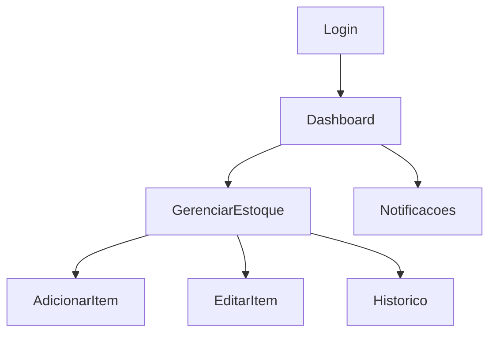

# Relatório do Projeto: Aplicação para Gestão de Estoque

## Estrutura do Projeto

A aplicação foi desenvolvida utilizando **Android Studio** e implementada com as linguagens **Kotlin** e **Java**. O projeto segue o padrão de arquitetura **MVVM (Model-View-ViewModel)**, com as seguintes camadas principais:

- **Model**: Gerenciamento de dados e integração com o banco de dados Firebase (Firestore).
- **ViewModel**: Camada intermediária que conecta a View com os dados.
- **View**: Composta pelas telas desenvolvidas em XML e manipuladas via atividades e fragments.

### Organização dos Pacotes

1. **`com.supermercado.stock`**: Contém as classes principais e lógica geral.
2. **`com.supermercado.stock.ui`**: Interfaces de usuário, incluindo activities e fragments.
3. **`com.supermercado.stock.data`**: Classes responsáveis pelo acesso a dados, incluindo integração com o Firebase Firestore.

## Lista de Funcionalidades

- **Login e Registro de Usuário**:
  - Implementado com Firebase Authentication para autenticação segura.
- **Gerenciamento de Estoque**:
  - Adição, edição e exclusão de itens do estoque.
  - Visualização detalhada dos itens.
- **Histórico de Movimentações**:
  - Registro automático de movimentações de entrada e saída de estoque.
- **Notificações**:
  - Alerta para níveis baixos de estoque via sistema de notificações.

## Desenhos, Esquemas e Protótipos

### Fluxograma do Funcionamento

### Protótipos de Telas
- Tela de Login
- Tela de Gerenciamento de Estoque
- Tela de Notificações
- Tela de Histórico de Movimentações

Imagens ou capturas de tela podem ser adicionadas aqui.

## Modelo de Dados

### Estrutura no Firebase Firestore

- **Coleção `usuarios`**:
  - `id` (string): Identificador único do usuário.
  - `nome` (string): Nome do usuário.

- **Coleção `estoque`**:
  - `id` (string): Identificador único do item.
  - `nome` (string): Nome do item.
  - `quantidade` (int): Quantidade atual do item.
  - `descricao` (string): Descrição do item.

## Implementação do Projeto

### Firebase
- **Authentication**: Gerencia o login e registro de usuários.
- **Firestore**: Banco de dados em tempo real para armazenar informações do estoque.

### MVVM
- **Model**: Responsável pelo gerenciamento de dados.
- **ViewModel**: Comunicação entre Model e View, observando alterações nos dados.
- **View**: Interface com o usuário, implementada em XML e Kotlin.

### Tecnologias e Bibliotecas Usadas
- Android Studio
- Kotlin + Java
- Firebase Authentication
- Firebase Firestore
- Material Design Components
- Glide (para imagens, se necessário)
- Coroutines para operações assíncronas

## Dificuldades

- Configuração inicial do Firebase e integração com Android.
- Aprendizagem do padrão MVVM e aplicação prática.
- Sincronização em tempo real com Firestore.

## Conclusões

O projeto atingiu os objetivos principais, fornecendo uma ferramenta prática para o gerenciamento de estoque de um supermercado. 

### Pontos de Melhoria
- Implementação de relatórios gerenciais mais detalhados.
- Integração com APIs de terceiros para expansão de funcionalidades.
