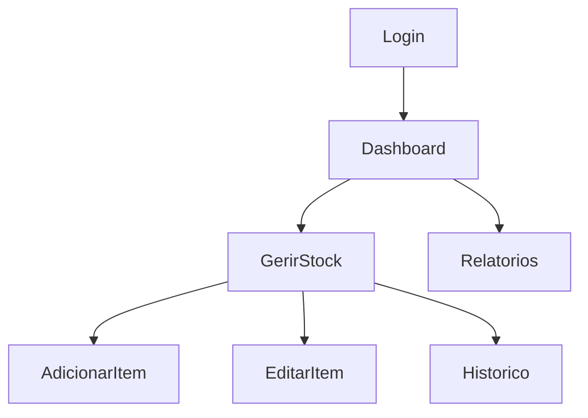

# Relatório do Projeto: Aplicação para Gestão de Stock um Supermercado

## Introdução

Este projeto tem como objetivo o desenvolvimento de uma aplicação móvel destinada à **gestão de stock de um supermercado**, permitindo que os funcionários possam gerir os itens do armazém de forma eficiente e prática. A aplicação foi projetada para aproveitar os recursos do Firebase e as melhores práticas de desenvolvimento Android, como o padrão arquitetural **MVVM (Model-View-ViewModel)**.

A aplicação utiliza as linguagens **Kotlin** e **Java**, integradas no **Android Studio**, e incorpora funcionalidades como autenticação, persistência de dados e visualização intuitiva de informações.

---

## Estrutura do Projeto

### Organização dos Pacotes

#### **Pacote Principal: `com.example.trabalhofinal`**

- **`models`**: Contém as classes de modelo que representam os dados da aplicação.
  - `Item.kt`: Representa um item no stock.
  - `User.kt`: Representa os dados do utilizador.

- **`repositories`**: Contém os repositórios que gerem o acesso a dados.
  - `ItemRepository.kt`: Gere os dados relacionados a itens.
  - `UserRepository.kt`: Gere os dados relacionados a utilizadores.

- **`ui`**: Contém os componentes da interface do utilizador (UI), organizados em subpacotes:
  - **`encomendas`**:
    - `EncomendasItemsView.kt`: Ecrã para visualizar encomendas.
    - `EncomendasItemsViewModel.kt`: ViewModel para gerir a lógica relacionada a encomendas.

  - **`ExpiredItems`**:
    - `ExpiredItemsView.kt`: Ecrã para visualizar itens expirados.
    - `ExpiredItemsViewModel.kt`: ViewModel correspondente à lógica de itens expirados.
    - `ExpiredItemsViewPreview.kt`: Pré-visualização para testes de UI.

  - **`home`**:
    - `HomeView.kt`: Ecrã inicial da aplicação.

  - **`lists.items`**:
    - `AddItemView.kt`: Ecrã para adicionar novos itens ao stock.
    - `AddItemViewModel.kt`: ViewModel correspondente ao ecrã de adição de itens.
    - `ItemRowView.kt`: Visualização individual de itens na lista.
    - `ListItemsView.kt`: Ecrã para listar os itens no stock.
    - `ListItemsViewModel.kt`: ViewModel correspondente ao ecrã de listagem de itens.

  - **`login`**:
    - `LoginView.kt`: Ecrã de login para os utilizadores.
    - `LoginViewModel.kt`: ViewModel correspondente à lógica de autenticação.

  - **`profile`**:
    - Gere funcionalidades relacionadas ao perfil do utilizador (detalhes não especificados).

  - **`theme`**:
    - Gere temas e estilos visuais da aplicação.

---

## Lista de Funcionalidades

- **Login e Registo de Utilizador**:
  - Implementado com Firebase Authentication para autenticação segura.
- **Gestão de Stock**:
  - Adição, edição e eliminação de itens no stock.
  - Visualização detalhada dos itens.
- **Histórico de Movimentações**:
  - Registo automático de movimentações de entrada e saída de stock.
- **Relatórios Gerenciais**:
  - Geração de relatórios simples para análise de movimentação de stock.

---

## Desenhos, Esquemas e Protótipos

### Fluxograma do Funcionamento

### Protótipos de Ecrãs

- **Ecrã de Login**: Interface para autenticação de utilizadores.
- **Ecrã de Gestão de Stock**: Ecrã principal para visualizar e gerir itens.
- **Ecrã de Relatórios**: Apresenta dados consolidados do stock.
- **Ecrã de Histórico**: Detalha todas as movimentações realizadas no sistema.

Imagens ou capturas de ecrã podem ser adicionadas aqui para ilustrar.

---

## Modelo de Dados

### Estrutura no Firebase Firestore

- **Coleção `utilizadores`**:
  - `id` (string): Identificador único do utilizador.
  - `nome` (string): Nome do utilizador.
  - `email` (string): Email do utilizador.

- **Coleção `stock`**:
  - `id` (string): Identificador único do item.
  - `nome` (string): Nome do item.
  - `quantidade` (int): Quantidade atual do item.
  - `descricao` (string): Descrição do item.
  - `validade` (date): Data de validade do item.

- **Coleção `historico`**:
  - `id` (string): Identificador único da movimentação.
  - `tipo` (string): Tipo da movimentação (entrada/saída).
  - `data` (timestamp): Data e hora da movimentação.
  - `quantidade` (int): Quantidade movimentada.

---

## Implementação do Projeto

### Firebase
- **Authentication**: Gere o login e registo de utilizadores.
- **Firestore**: Base de dados em tempo real para armazenar informações do stock.

### MVVM
- **Model**: Responsável pela gestão de dados.
- **ViewModel**: Comunicação entre Model e View, observando alterações nos dados.
- **View**: Interface com o utilizador, implementada em XML e Kotlin.

### Tecnologias e Bibliotecas Usadas

- **Android Studio**
- **Kotlin + Java**
- **Firebase Authentication**
- **Firebase Firestore**
- **Material Design Components**
- **Glide** (para carregamento de imagens)
- **Coroutines** (para operações assíncronas)
- **LiveData** e **ViewModel** (para gestão de estados reativos)

---

## Dificuldades

- Configuração inicial do Firebase e integração com Android.
- Aprendizagem do padrão MVVM e aplicação prática.
- Sincronização em tempo real com Firestore.
- Design de interfaces responsivas e intuitivas.

---

## Conclusões

O projeto atingiu os objetivos principais, fornecendo uma ferramenta prática e funcional para a gestão de stock de um supermercado. A aplicação oferece uma interface intuitiva e funcionalidades robustas para os utilizadores, explorando as capacidades do Firebase e Android.

### Pontos de Melhoria

- **Relatórios Avançados**: Implementar gráficos e visualizações dinâmicas para análise de dados.
- **Integração com APIs de Terceiros**: Para funcionalidades como previsão de procura ou integração com fornecedores.
- **Otimizações de Performance**: Melhorar a sincronização de dados em tempo real e reduzir o uso de recursos.

---

Este projeto demonstra a aplicação prática de conceitos aprendidos ao longo do curso, integrando tecnologia moderna com boas práticas de desenvolvimento.
