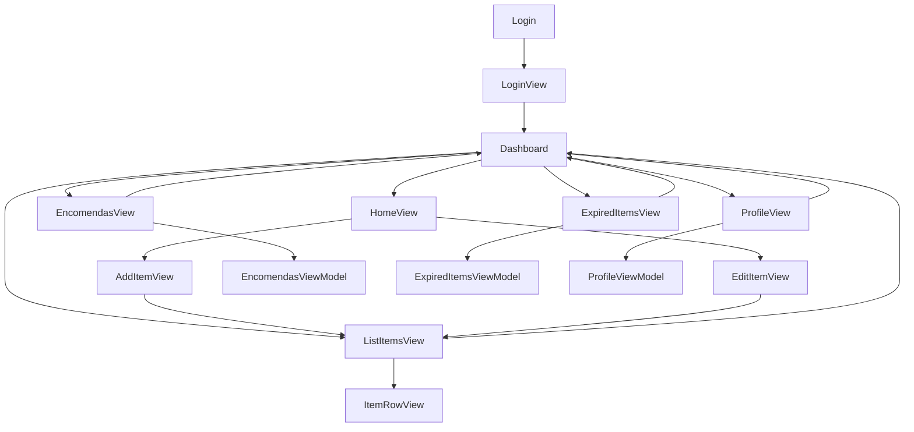

# Relatório do Projeto: Aplicação para Gestão de Stock um Supermercado 
  - __Trabalho Realizado por : Marco Macedo Nº27919 | Miguel Freitas Nº29562__

# __Indíce__
1. [__Introdução__](#Introdução)
2. [__Estrutura do Projeto__](#estrutura)
   - [__Estrutura de Pastas__](#estruturapastas)
   - [__Organização das Pastas__](#organizacaopastas)
3. [__Lista de Funcionalidades__](#funcionalidades)
4. [__Desenhos, Esquemas e Protótipos__](#dep)
   - [__Fluxograma do Funcionamento__](#fluxograma)
   - [__Protótipos de Ecrãs__](#Prototipodeecras)
5. [__Modelo de Dados__](#modelodados)
   - [__Estrutura no Firebase Firestore__](#estruturafirebase)
6. [__Implementação do Projeto__](#implementacaoprojeto)
   - [__Firebase__](#firebase)
   - [__MVVM__](#mvvm)
   - [__Tecnologias e Bibliotecas Usadas__](#tecnologias)
7. [__Dificuldades__](#Dificuldades)
8. [__Conclusão__](#Conclusão)

## Introdução

Este projeto tem como objetivo o desenvolvimento de uma aplicação móvel destinada à **gestão de stock de um supermercado por o Staff**, permitindo que os funcionários possam gerir os itens do armazém de forma eficiente e prática. A aplicação foi projetada para aproveitar os recursos do Firebase e as melhores práticas de desenvolvimento Android, como o padrão arquitetural **MVVM (Model-View-ViewModel)**.

A aplicação utiliza as linguagens **Kotlin** e **Java**, integradas no **Android Studio**, e incorpora funcionalidades como autenticação, persistência de dados e visualização intuitiva de informações.

---
<a name="estrutura"></a>
## Estrutura do Projeto

<a name="estruturapastas"></a>
### Estrutura de Pastas:


```plaintext
com.example.trabalhofinal/
│
├── MainActivity.kt
│
├── models/
│   ├── Item.kt
│   └── User.kt
│
├── repositories/
│   ├── ItemRepository.kt
│   └── UserRepository.kt
│
├── ui/
│   ├── Encomendas/
│   │   ├── EncomendasView.kt
│   │   └── EncomendasViewModel.kt
|   |
│   ├── ExpiredItems/
│   │   ├── ExpiredItemsView.kt
│   │   ├── ExpiredItemsViewModel.kt
│   │   └── ExpiredItemsViewPreview.kt
│   │
│   ├── home/
│   │   └── HomeView.kt
│   │
│   ├── lists.items/
│   │   ├── AddItemView.kt
│   │   ├── AddItemViewModel.kt
│   │   ├── ItemRowView.kt
│   │   ├── ListItemsView.kt
│   │   └── ListItemsViewModel.kt
│   │
│   ├── login/
│   │   ├── LoginView.kt
│   │   └── LoginViewModel.kt
│   │
│   ├── profile/
│   │   ├── ProfileView.kt
|   |   └── ProfileViewModel.kt
│   │
|   ├── register/
|   |   ├── RegisterView.kt
|   |   └── RegisterViewModel.kt
|   | 
│   └── theme/
│       ├── Color.kt
│       ├── Theme.kt
│       └── Type.kt
│
└── resources/
    ├── layout/
    └── values/
        ├── colors.xml
        ├── strings.xml
        ├── dimens.xml
        └── styles.xml

```

<a name="organizacaopastas"></a>
### Organização das Pastas

#### **Nome Principal: `com.example.trabalhofinal`**

- **`MainActivity.kt`**: O ponto de entrada da aplicação, responsável por configurar e gerenciar a navegação entre os diferentes ecrãs da app, utilizando NavController para fragmentos.

- **`models`**: Contém as classes de modelo que representam os dados da aplicação.
  - `Item.kt`: Representa um item no stock.
  - `User.kt`: Representa os dados do utilizador.

- **`repositories`**: Contém os repositórios que gerem o acesso a dados.
  - `ItemRepository.kt`: Gere os dados relacionados a itens.
  - `UserRepository.kt`: Gere os dados relacionados a utilizadores.

- **`ui`**: Contém os componentes da interface do utilizador (UI), organizados em subpacotes:
  - **`Encomendas`**:
    - `EncomendasView.kt`: Ecrã para visualizar encomendas.
    - `EncomendasViewModel.kt`: ViewModel para gerir a lógica relacionada a encomendas.

  - **`ExpiredItems`**:
    - `ExpiredItemsView.kt`: Ecrã para visualizar itens expirados.
    - `ExpiredItemsViewModel.kt`: ViewModel correspondente à lógica de itens expirados.
    - `ExpiredItemsViewPreview.kt`: Pré-visualização para testes de UI.

  - **`home`**:
    - `HomeView.kt`: Ecrã inicial da aplicação.

  - **`lists.items`**:
    - `AddItemView.kt`: Ecrã para adicionar novos itens ao stock.
    - `AddItemViewModel.kt`: ViewModel correspondente ao ecrã de adição de itens.
    - `ItemRowView.kt`: Visualização individual de itens na lista.
    - `ListItemsView.kt`: Ecrã para listar os itens no stock.
    - `ListItemsViewModel.kt`: ViewModel correspondente ao ecrã de listagem de itens.

  - **`login`**:
    - `LoginView.kt`: Ecrã de login para os utilizadores.
    - `LoginViewModel.kt`: ViewModel correspondente à lógica de autenticação.

  - **`profile`**:
    - `ProfileView.kt`: Gere funcionalidades relacionadas ao perfil do utilizador (detalhes não especificados).
    - `ProfileViewModel.kt`: ViewModel correspondente à lógica de profile.

  - **`register`**:
    - `RegisterView.kt`: Gere funcionalidades relacionadas ao registro do utilizador.
    - `RegisterViewModel.kt`: ViewModel correspondente à lógica de register.


  - **`theme`**:
    - `Color.kt`: Contém as definições de cores utilizadas na aplicação.
    - `Theme.kt`: Define o tema geral da aplicação (cores, fontes, estilos).
    - `Type.kt`:  Contém estilos de tipografia para a aplicação.
  

---
<a name="funcionalidades"></a>
## Lista de Funcionalidades

- **Login e Registo de Utilizador**:
  - Implementado com Firebase Authentication para autenticação segura.
- **Gestão de Stock**:
  - Adição e eliminação de itens no stock através de interfaces intuitivas:
    - **AddItemView**: Permite adicionar novos itens ao stock.
    - **ListItemsView**: Lista todos os itens disponíveis no stock.
    - **ItemRowView**: Apresenta informações de cada item individualmente.
- **Gestão de Encomendas**  
  - **EncomendasView**: Permite visualizar e gerir encomendas realizadas.
- **Gestão de Itens Expirados**  
  - **ExpiredItemsView**: Apresenta uma lista de itens expirados para ações corretivas.
  - **ExpiredItemsViewPreview**: Pré-visualizações para desenvolvimento e testes.
- **Gestão de Perfil**  
  - **ProfileView**: Exibição e edição de informações do perfil do utilizador.
    
---

<a name="dep"></a>
## Desenhos, Esquemas e Protótipos

<a name="fluxograma"></a>
### Fluxograma do Funcionamento


<a name="Prototipodeecras"></a>
### Protótipos de Ecrãs

- **Ecrã de Login**: Interface para autenticação de utilizadores.
- **Ecrã de Register**: Interface para registrar os utilizadores.
- **Ecrã de Profile**: Interface para colocar o nome do Perfil.
- **Ecrã de Gestão de Stock**: Ecrã principal para visualizar e gerir itens.
- **Ecrã de Ver Itens**: Ecrã para ver, adicionar, remover e mover os itens para encomendas/fora de validade
- **Ecrã de Itens Fora da Validade**: Ecrã para ver os itens movidos para fora de validade.
- **Ecrã de Para Encomendar**: Ecrã para ver as encomendas adicionadas.


Imagens ou capturas de ecrã podem ser adicionadas aqui para ilustrar.

---
<a name="modelodados"></a>
## Modelo de Dados

<a name="estruturafirebase"></a>
### Estrutura no Firebase Firestore

- **Coleção `utilizadores`**:
  - `id` (string): Identificador único do utilizador.
  - `nome` (string): Nome do utilizador.
  - `email` (string): Email do utilizador.

- **Coleção `Encomendas`**:
  - `id` (string): Identificador único do utilizador.
  - `nome` (string): Nome do utilizador.
  - `qtd` (Double): Email do utilizador.
  
- **Coleção `stock`**:
  - `id` (string): Identificador único do item.
  - `nome` (string): Nome do item.
  - `quantidade` (int): Quantidade atual do item.
  - `descricao` (string): Descrição do item.
  - `validade` (date): Data de validade do item.

- **Coleção `historico`**:
  - `id` (string): Identificador único da movimentação.
  - `tipo` (string): Tipo da movimentação (entrada/saída).
  - `data` (timestamp): Data e hora da movimentação.
  - `quantidade` (int): Quantidade movimentada.

---
<a name="implementacaoprojeto"></a>
## Implementação do Projeto

<a name="firebase"></a>
### Firebase
- **Authentication**: Gere o login e registo de utilizadores.
- **Firestore**: Base de dados em tempo real para armazenar informações do stock.

<a name="mvvm"></a>
### MVVM
- **Model**: Responsável pela gestão de dados.
- **ViewModel**: Comunicação entre Model e View, observando alterações nos dados.
- **View**: Interface com o utilizador, implementada em XML e Kotlin.

<a name="tecnologias"></a>
### Tecnologias e Bibliotecas Usadas

- **Android Studio**
- **Kotlin + Java**
- **Firebase Authentication**
- **Firebase Firestore**
- **Material Design Components**
- **Glide** (para carregamento de imagens)
- **Coroutines** (para operações assíncronas)
- **LiveData** e **ViewModel** (para gestão de estados reativos)

---

## Dificuldades

- Configuração inicial do Firebase e integração com Android.
- Aprendizagem do padrão MVVM e aplicação prática.
- Sincronização em tempo real com Firestore.
- Design de interfaces responsivas e intuitivas.

---

## Conclusão

O projeto atingiu os objetivos principais, fornecendo uma ferramenta prática e funcional para a gestão de stock de um supermercado. A aplicação oferece uma interface intuitiva e funcionalidades robustas para os utilizadores, explorando as capacidades do Firebase e Android.

### Pontos de Melhoria

- **Relatórios Avançados**: Implementar gráficos e visualizações dinâmicas para análise de dados.
- **Integração com APIs de Terceiros**: Para funcionalidades como previsão de procura ou integração com fornecedores.
- **Otimizações de Performance**: Melhorar a sincronização de dados em tempo real e reduzir o uso de recursos.

---

Este projeto demonstra a aplicação prática de conceitos aprendidos ao longo do curso, integrando tecnologia moderna com boas práticas de desenvolvimento.
